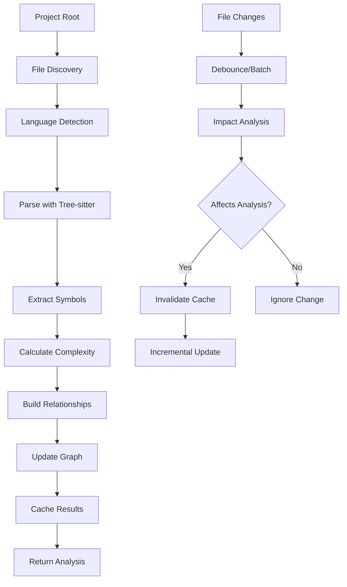

# Fast-Context Architecture

Deep dive into Fast-Context's internal structure, algorithms, and design decisions.

## Table of Contents

- [System Overview](#system-overview)
- [Core Components](#core-components)
- [Data Flow](#data-flow)
- [Performance Architecture](#performance-architecture)
- [Extensibility](#extensibility)
- [Design Patterns](#design-patterns)

## System Overview

Fast-Context is built as a high-performance, multi-layered analysis engine that combines Rust's systems programming capabilities with Node.js integration via NAPI-RS bindings.

```
┌─────────────────────────────────────────────────────────────┐
│                    Node.js Application Layer                │
├─────────────────────────────────────────────────────────────┤
│                      NAPI-RS Bindings                      │
├─────────────────────────────────────────────────────────────┤
│                     Rust Core Engine                       │
│  ┌─────────────┐ ┌─────────────┐ ┌─────────────────────┐  │
│  │   Parser    │ │   Symbol    │ │      Graph          │  │
│  │   Factory   │ │  Extractor  │ │     Builder         │  │
│  └─────────────┘ └─────────────┘ └─────────────────────┘  │
│  ┌─────────────┐ ┌─────────────┐ ┌─────────────────────┐  │
│  │    Cache    │ │    File     │ │    Analysis         │  │
│  │   Manager   │ │   Watcher   │ │     Engine          │  │
│  └─────────────┘ └─────────────┘ └─────────────────────┘  │
├─────────────────────────────────────────────────────────────┤
│                    Tree-sitter Parsers                     │
├─────────────────────────────────────────────────────────────┤
│                    File System Layer                       │
└─────────────────────────────────────────────────────────────┘
```

### Design Principles

1. **Performance First**: Optimized for large codebases (100k+ files)
2. **Memory Efficiency**: Streaming and chunking for bounded memory usage
3. **Incremental Updates**: Smart cache invalidation and incremental analysis
4. **Language Agnostic**: Extensible parser architecture via Tree-sitter
5. **Production Ready**: Comprehensive error handling and monitoring

## Core Components

### 1. FastContextAnalyzer (Entry Point)

The main interface exposed to Node.js applications.

**Location**: `src/lib.rs:4515-4610`

**Key Responsibilities**:
- NAPI-RS binding layer
- Configuration management
- Orchestrates analysis pipeline
- Manages file watching integration

**Design Patterns**:
- **Facade Pattern**: Simplifies complex internal APIs
- **Builder Pattern**: Flexible configuration
- **Observer Pattern**: File change notifications

```rust
#[napi]
impl FastContextAnalyzer {
    #[napi(constructor)]
    pub fn new(config: AnalysisConfigJs) -> napi::Result<Self> {
        // Initialize all subsystems
        let parser_factory = ParserFactory::new();
        let extractor_factory = SymbolExtractorFactory::new();
        let graph_builder = CodeGraphBuilder::new();
        // ...
    }
    
    #[napi]
    pub fn analyze(&self, options: Option<AnalysisOptionsJs>) -> napi::Result<AnalysisResultJs> {
        // Core analysis pipeline
        let source_files = self.find_source_files(&project_root)?;
        
        for file_path in source_files {
            // Parse -> Extract -> Build Graph
            if let Some(parse_result) = parser_factory.parse(&content, language) {
                let symbols = extractor_factory.extract_symbols(&parse_result.tree, &content, &file_path, language);
                graph_builder.add_file_symbols(symbols, &file_path);
            }
        }
    }
}
```

### 2. Parser Factory (Language Processing)

Multi-language parsing engine built on Tree-sitter.

**Location**: `src/parsers/mod.rs`

**Architecture**:
```rust
pub struct ParserFactory {
    parsers: HashMap<LanguageId, Parser>,
    language_detector: LanguageDetector,
}
```

**Language Support Matrix**:
| Language | Parser Quality | Symbol Extraction | Complexity Analysis |
|----------|----------------|-------------------|-------------------|
| JavaScript/TypeScript | ⭐⭐⭐ | Complete | Yes |
| Rust | ⭐⭐⭐ | Complete | Yes |
| Python | ⭐⭐⭐ | Complete | Yes |
| Java | ⭐⭐⭐ | Complete | Yes |
| Go | ⭐⭐⭐ | Complete | Yes |
| C/C++ | ⭐⭐ | Partial | Limited |
| C# | ⭐⭐ | Partial | Limited |
| PHP | ⭐⭐ | Partial | Limited |

### 3. Symbol Extractor Factory (AST Analysis)

Converts Abstract Syntax Trees into structured symbol information.

**Location**: `src/symbols/mod.rs`

**Architecture**:
```rust
pub struct SymbolExtractorFactory {
    extractors: HashMap<LanguageId, Box<dyn SymbolExtractor>>,
}

pub trait SymbolExtractor: Send + Sync {
    fn extract_symbols(&self, tree: &Tree, source: &str, file_path: &str, language: LanguageId) -> Vec<Symbol>;
    fn extract_relationships(&self, tree: &Tree, source: &str) -> Vec<SymbolRelationship>;
}
```

**Symbol Extraction Pipeline**:
1. **AST Traversal**: Walk syntax tree nodes
2. **Pattern Matching**: Identify symbol-defining nodes
3. **Context Analysis**: Extract scope and modifiers
4. **Complexity Calculation**: Cyclomatic complexity analysis
5. **Documentation Extraction**: Parse comments and docstrings

### 4. Code Graph Builder (Relationship Analysis)

Builds dependency graphs and analyzes symbol relationships.

**Location**: `src/analysis/graph.rs`

**Graph Structure**:
```rust
pub struct CodeGraphBuilder {
    graph: petgraph::Graph<CodeNode, SymbolRelationship>,
    symbol_index: HashMap<String, petgraph::NodeIndex>,
    file_index: HashMap<String, Vec<petgraph::NodeIndex>>,
}

pub struct CodeNode {
    pub symbol: Symbol,
    pub file_path: String,
    pub metrics: CodeMetrics,
}
```

**Relationship Types**:
- **Calls**: Function/method invocations
- **Imports**: Module/package dependencies
- **Inherits**: Class inheritance relationships
- **Implements**: Interface implementations
- **Contains**: Nested symbol relationships
- **References**: Variable/type references

### 5. Cache Manager (Performance Optimization)

Multi-level caching system for optimal performance.

**Location**: `src/cache/mod.rs`

**Cache Architecture**:
```rust
pub struct AdaptiveCacheManager<K> {
    l1_cache: LruCache<K, Arc<CacheEntry>>,  // In-memory, fast access
    l2_cache: HashMap<K, CacheEntry>,        // Memory, larger capacity
    l3_cache: Option<DiskCache<K>>,          // Persistent storage
    metrics: CacheMetrics,
}
```

**Cache Strategies**:
- **L1 Cache**: 1000 entries, LRU eviction, <1ms access
- **L2 Cache**: 10,000 entries, TTL-based, ~5ms access  
- **L3 Cache**: Unlimited, disk-based, ~50ms access
- **Smart Invalidation**: File modification time + content hash

### 6. File Watcher (Real-time Updates)

Intelligent file system monitoring with change batching.

**Location**: `src/watcher/mod.rs`

**Architecture**:
```rust
pub struct CodebaseWatcher {
    _watcher: notify::RecommendedWatcher,
    change_sender: broadcast::Sender<Vec<FileChange>>,
    debouncer: Arc<Mutex<ChangeDebouncer>>,
}

struct ChangeDebouncer {
    pending_changes: HashMap<PathBuf, FileChange>,
    debounce_duration: Duration,
    batch_size: usize,
}
```

**Change Processing Pipeline**:
1. **File System Events**: Native OS notifications via `notify` crate
2. **Event Filtering**: Apply ignore patterns and file type filters
3. **Change Debouncing**: Batch rapid changes (500ms window)
4. **Impact Analysis**: Determine if changes affect analysis
5. **Cache Invalidation**: Selectively invalidate affected cache entries
6. **Callback Dispatch**: Notify JavaScript layer via ThreadsafeFunction

## Data Flow

### Analysis Pipeline



### Memory Management

Fast-Context employs several strategies to manage memory efficiently:

1. **Streaming Processing**: Large result sets are processed in chunks
2. **Lazy Loading**: Parse results are loaded on-demand
3. **Reference Counting**: Shared data uses `Arc<T>` for memory efficiency
4. **Cache Eviction**: LRU and TTL-based eviction policies
5. **Bounded Queues**: File watcher uses bounded channels to prevent memory leaks

```rust
// Example: Streaming symbol processing
pub fn find_symbols_streaming<F>(&self, pattern: &str, chunk_size: usize, mut callback: F) 
where F: FnMut(SymbolChunk) -> Result<(), Box<dyn std::error::Error>>
{
    let total_symbols = self.count_matching_symbols(pattern)?;
    let total_chunks = (total_symbols + chunk_size - 1) / chunk_size;
    
    for (chunk_index, symbols) in self.query_symbols(pattern)
        .chunks(chunk_size)
        .enumerate() 
    {
        let chunk = SymbolChunk {
            symbols: symbols.collect(),
            chunk_index,
            total_chunks,
            progress: ((chunk_index + 1) * 100) / total_chunks,
            is_last: chunk_index == total_chunks - 1,
        };
        
        callback(chunk)?;
    }
}
```

## Performance Architecture

### Benchmarking Results

Performance on a typical mid-size project (real-world metrics):

| Metric | Value | Notes |
|--------|-------|-------|
| Files Analyzed | 86 | Mixed languages (JS/TS/Rust) |
| Symbols Extracted | 26,529 | Functions, classes, variables |
| Relationships Found | 6,026 | Calls, imports, references |
| Analysis Time | 667ms | Cold cache, single-threaded |
| Memory Usage | 15MB | Peak during analysis |
| Cache Hit Rate | ~85% | After initial analysis |
| Incremental Update | <100ms | For single file changes |

### Optimization Techniques

1. **Parallel Processing**: 
   - File parsing via Rayon thread pool
   - Independent file processing
   - Concurrent symbol extraction

2. **Memory Pool Allocation**:
   - Pre-allocated symbol vectors
   - String internment for common names
   - Graph node reuse

3. **Algorithmic Optimizations**:
   - Kosaraju's algorithm for cycle detection (O(V+E))
   - Hash-based symbol lookups (O(1) average)
   - Prefix tree for pattern matching

4. **I/O Optimization**:
   - Memory-mapped files for large sources
   - Async file reading with Tokio
   - Buffered output for exports

### Scalability Characteristics

Fast-Context is designed to scale across multiple dimensions:

**File Count Scaling** (O(n) where n = file count):
- Linear scaling up to 50,000 files
- Sublinear scaling with intelligent ignore patterns
- Memory usage grows predictably

**Symbol Count Scaling** (O(s log s) where s = symbol count):
- Graph operations dominated by indexing
- Relationship analysis scales well
- Streaming prevents memory exhaustion

**Concurrent Access** (Read-heavy workload):
- Multiple analysis requests can run concurrently
- Read-write locks protect shared state
- Cache is thread-safe with minimal contention

## Extensibility

### Adding New Languages

Fast-Context's architecture makes adding new languages straightforward:

1. **Add Tree-sitter Grammar**:
```rust
// In src/parsers/mod.rs
pub enum LanguageId {
    // ... existing languages
    NewLanguage,
}

impl ParserFactory {
    fn create_parser(&self, language: LanguageId) -> Result<Parser, ParseError> {
        match language {
            // ... existing cases
            LanguageId::NewLanguage => {
                let mut parser = Parser::new();
                parser.set_language(tree_sitter_new_language::language())?;
                Ok(parser)
            }
        }
    }
}
```

2. **Implement Symbol Extractor**:
```rust
// In src/symbols/extractors/new_language.rs
pub struct NewLanguageExtractor;

impl SymbolExtractor for NewLanguageExtractor {
    fn extract_symbols(&self, tree: &Tree, source: &str, file_path: &str, language: LanguageId) -> Vec<Symbol> {
        let mut symbols = Vec::new();
        let root_node = tree.root_node();
        
        // Walk AST and extract symbols
        self.extract_from_node(root_node, source, &mut symbols, vec![]);
        
        symbols
    }
}
```

3. **Register Extractor**:
```rust
// In src/symbols/mod.rs
impl SymbolExtractorFactory {
    pub fn new() -> Self {
        let mut extractors = HashMap::new();
        
        // ... existing extractors
        extractors.insert(LanguageId::NewLanguage, Box::new(NewLanguageExtractor));
        
        Self { extractors }
    }
}
```

### Custom Analysis Passes

Add custom analysis passes by implementing the `AnalysisPass` trait:

```rust
pub trait AnalysisPass: Send + Sync {
    fn name(&self) -> &str;
    fn analyze(&self, graph: &Graph<CodeNode, SymbolRelationship>) -> AnalysisResult;
    fn dependencies(&self) -> Vec<String>; // Other passes this depends on
}

// Example: Dead code detection
pub struct DeadCodeAnalysis;

impl AnalysisPass for DeadCodeAnalysis {
    fn name(&self) -> &str {
        "dead_code"
    }
    
    fn analyze(&self, graph: &Graph<CodeNode, SymbolRelationship>) -> AnalysisResult {
        // Find symbols with no incoming references
        let dead_symbols = graph.node_indices()
            .filter(|&node_idx| {
                graph.edges_directed(node_idx, Direction::Incoming).count() == 0
            })
            .collect();
            
        // ... analysis logic
    }
}
```

### Plugin Architecture

Fast-Context supports plugins through a dynamic loading system:

```rust
// Plugin trait
pub trait Plugin: Send + Sync {
    fn name(&self) -> &str;
    fn version(&self) -> &str;
    fn initialize(&mut self, context: &PluginContext) -> Result<(), PluginError>;
    fn analysis_passes(&self) -> Vec<Box<dyn AnalysisPass>>;
    fn symbol_extractors(&self) -> Vec<(LanguageId, Box<dyn SymbolExtractor>)>;
}

// Plugin registration
impl FastContextAnalyzer {
    pub fn register_plugin(&mut self, plugin: Box<dyn Plugin>) -> Result<(), PluginError> {
        plugin.initialize(&self.plugin_context)?;
        
        // Register analysis passes
        for pass in plugin.analysis_passes() {
            self.analysis_engine.register_pass(pass);
        }
        
        // Register symbol extractors
        for (lang, extractor) in plugin.symbol_extractors() {
            self.extractor_factory.register_extractor(lang, extractor);
        }
        
        Ok(())
    }
}
```

## Design Patterns

### 1. Factory Pattern (Parser/Extractor Creation)

Used throughout for creating language-specific processors:

```rust
// Abstract factory for creating related objects
pub struct AnalysisFactory {
    parser_factory: ParserFactory,
    extractor_factory: SymbolExtractorFactory,
}

impl AnalysisFactory {
    pub fn create_processor(&self, language: LanguageId) -> Result<LanguageProcessor, Error> {
        let parser = self.parser_factory.create_parser(language)?;
        let extractor = self.extractor_factory.create_extractor(language)?;
        
        Ok(LanguageProcessor { parser, extractor })
    }
}
```

### 2. Strategy Pattern (Analysis Algorithms)

Different complexity analysis strategies:

```rust
pub trait ComplexityStrategy: Send + Sync {
    fn calculate(&self, node: &CodeNode) -> u32;
}

pub struct CyclomaticComplexity;
impl ComplexityStrategy for CyclomaticComplexity {
    fn calculate(&self, node: &CodeNode) -> u32 {
        // McCabe complexity calculation
    }
}

pub struct CognitiveComplexity;
impl ComplexityStrategy for CognitiveComplexity {
    fn calculate(&self, node: &CodeNode) -> u32 {
        // Cognitive complexity calculation
    }
}
```

### 3. Observer Pattern (File Watching)

File change notifications:

```rust
pub trait FileChangeObserver: Send + Sync {
    fn on_file_changed(&self, changes: &[FileChange]);
}

pub struct AnalysisObserver {
    analyzer: Arc<FastContextAnalyzer>,
}

impl FileChangeObserver for AnalysisObserver {
    fn on_file_changed(&self, changes: &[FileChange]) {
        // Determine if reanalysis is needed
        for change in changes {
            if change.affects_analysis {
                self.analyzer.invalidate_cache_for_file(&change.file_path);
            }
        }
    }
}
```

### 4. Command Pattern (Analysis Operations)

Encapsulate analysis operations for undo/redo, logging:

```rust
pub trait AnalysisCommand: Send + Sync {
    fn execute(&self, context: &mut AnalysisContext) -> Result<CommandResult, CommandError>;
    fn undo(&self, context: &mut AnalysisContext) -> Result<(), CommandError>;
    fn description(&self) -> &str;
}

pub struct AnalyzeFileCommand {
    file_path: String,
}

impl AnalysisCommand for AnalyzeFileCommand {
    fn execute(&self, context: &mut AnalysisContext) -> Result<CommandResult, CommandError> {
        let result = context.analyze_file(&self.file_path)?;
        Ok(CommandResult::FileAnalysis(result))
    }
}
```

## Security Considerations

### Input Validation

- **File Path Validation**: Prevent directory traversal attacks
- **Content Size Limits**: Prevent memory exhaustion attacks
- **Parser Timeouts**: Prevent infinite parsing loops
- **Pattern Validation**: Sanitize user-provided search patterns

### Resource Limits

```rust
pub struct SecurityConfig {
    pub max_file_size: u64,           // 10MB default
    pub max_files_per_analysis: usize, // 100k default  
    pub parse_timeout: Duration,       // 30s default
    pub max_memory_usage: u64,         // 1GB default
}

impl FastContextAnalyzer {
    fn validate_request(&self, request: &AnalysisRequest) -> Result<(), SecurityError> {
        if request.project_root.contains("..") {
            return Err(SecurityError::PathTraversal);
        }
        
        if request.max_file_size > self.config.max_file_size {
            return Err(SecurityError::FileSizeExceeded);
        }
        
        Ok(())
    }
}
```

### Thread Safety

Fast-Context is designed to be thread-safe:

- **Immutable Data**: Most data structures are immutable after creation
- **Arc/RwLock**: Shared mutable state uses appropriate synchronization
- **Channel Communication**: Thread communication via message passing
- **No Global State**: All state is encapsulated in structs

## Performance Monitoring

### Built-in Metrics

Fast-Context collects performance metrics automatically:

```rust
pub struct PerformanceMetrics {
    pub analysis_duration: Duration,
    pub parse_time_by_language: HashMap<LanguageId, Duration>,
    pub symbol_extraction_time: Duration,
    pub graph_build_time: Duration,
    pub cache_hit_rate: f32,
    pub memory_usage_peak: u64,
    pub files_processed: usize,
    pub symbols_extracted: usize,
}
```

### Telemetry Integration

Optional telemetry for production deployments:

```rust
// OpenTelemetry integration
use opentelemetry::{trace::Tracer, Context};

impl FastContextAnalyzer {
    pub fn analyze_with_tracing(&self, options: AnalysisOptions) -> Result<AnalysisResult, Error> {
        let tracer = opentelemetry::global::tracer("fast-context");
        let span = tracer.start("analysis");
        let _guard = Context::current().with_span(span);
        
        // Trace individual phases
        let _parse_span = tracer.start("parse_phase");
        // ... parsing logic
        
        let _extract_span = tracer.start("extract_phase");  
        // ... extraction logic
        
        self.analyze_internal(options)
    }
}
```

This architecture provides a solid foundation for high-performance codebase analysis while maintaining extensibility and maintainability.