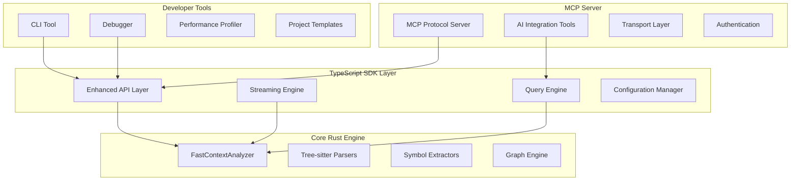

# TypeScript SDK Architecture
## Technical Design & Implementation Details

### 🏗️ System Architecture Overview



### 📦 Package Architecture

#### Monorepo Structure
```
@fast-context/
├── core/                     # Core TypeScript SDK
│   ├── src/
│   │   ├── analyzer/         # Enhanced analyzer wrapper
│   │   ├── streaming/        # Streaming analysis APIs
│   │   ├── query/           # Advanced query engine
│   │   ├── config/          # Configuration management
│   │   ├── types/           # TypeScript definitions
│   │   └── utils/           # Utility functions
│   └── package.json
├── cli/                      # Command-line interface
│   ├── src/
│   │   ├── commands/        # CLI command implementations
│   │   ├── repl/           # Interactive REPL mode
│   │   ├── templates/      # Project templates
│   │   └── utils/          # CLI utilities
│   └── package.json
├── mcp-server/              # MCP server implementation
│   ├── src/
│   │   ├── server/         # Core MCP server
│   │   ├── tools/          # AI integration tools
│   │   ├── transport/      # WebSocket/HTTP transport
│   │   └── auth/           # Authentication layer
│   └── package.json
├── dev-tools/               # Developer utilities
│   ├── src/
│   │   ├── debugger/       # Analysis debugger
│   │   ├── profiler/       # Performance profiler
│   │   ├── visualizer/     # Data visualization
│   │   └── benchmarks/     # Performance benchmarks
│   └── package.json
└── examples/                # Example implementations
    ├── basic-usage/
    ├── streaming-analysis/
    ├── cli-integration/
    └── mcp-integration/
```

### 🔧 Core API Design

#### Enhanced FastContextAnalyzer
```typescript
export class FastContextAnalyzer {
  private readonly nativeAnalyzer: NativeFastContextAnalyzer;
  private readonly config: AnalysisConfig;
  private readonly eventEmitter: EventEmitter;
  
  constructor(config: AnalysisConfig) {
    this.config = this.validateConfig(config);
    this.nativeAnalyzer = new NativeFastContextAnalyzer(this.config);
    this.eventEmitter = new EventEmitter();
  }
  
  // Streaming analysis with progress tracking
  async *analyzeStream(
    options?: StreamingOptions
  ): AsyncIterableIterator<AnalysisProgress> {
    const controller = new AbortController();
    
    try {
      for await (const progress of this.nativeAnalyzer.analyzeStream(
        this.config,
        { ...options, signal: controller.signal }
      )) {
        yield this.transformProgress(progress);
      }
    } catch (error) {
      if (error.name === 'AbortError') {
        throw new AnalysisCancelledError('Analysis was cancelled');
      }
      throw this.transformError(error);
    }
  }
  
  // Traditional promise-based analysis
  async analyze(): Promise<AnalysisResult> {
    const results = [];
    for await (const progress of this.analyzeStream()) {
      results.push(progress);
    }
    return results[results.length - 1].result;
  }
  
  // Query engine access
  getQueryEngine(): QueryEngine {
    return new QueryEngine(this.nativeAnalyzer, this.config);
  }
  
  // Configuration management
  updateConfig(updates: Partial<AnalysisConfig>): void {
    this.config = { ...this.config, ...updates };
    this.nativeAnalyzer.updateConfig(this.config);
  }
}
```

#### Advanced Query Engine
```typescript
export class QueryEngine {
  private readonly analyzer: NativeFastContextAnalyzer;
  private readonly cache: QueryCache;
  
  constructor(analyzer: NativeFastContextAnalyzer, config: AnalysisConfig) {
    this.analyzer = analyzer;
    this.cache = new QueryCache(config.caching);
  }
  
  // Semantic search capabilities
  async findSymbols(query: SemanticQuery): Promise<SymbolResult[]> {
    const cacheKey = this.getCacheKey('symbols', query);
    const cached = await this.cache.get(cacheKey);
    if (cached) return cached;
    
    const results = await this.analyzer.findSymbols(query);
    await this.cache.set(cacheKey, results);
    return results;
  }
  
  // Relationship analysis
  async getSymbolDependencies(
    symbol: string,
    options?: DependencyOptions
  ): Promise<DependencyGraph> {
    const depth = options?.depth ?? 3;
    const includeTransitive = options?.includeTransitive ?? true;
    
    return await this.analyzer.getSymbolDependencies(
      symbol,
      depth,
      includeTransitive
    );
  }
  
  // Architectural pattern detection
  async detectPatterns(): Promise<ArchitecturalPattern[]> {
    const patterns = await this.analyzer.detectArchitecturalPatterns();
    return patterns.map(p => this.enrichPattern(p));
  }
  
  // Code complexity analysis
  async analyzeComplexity(
    options?: ComplexityOptions
  ): Promise<ComplexityReport> {
    const threshold = options?.threshold ?? 10;
    const includeMetrics = options?.includeMetrics ?? true;
    
    return await this.analyzer.analyzeComplexity(threshold, includeMetrics);
  }
}
```

#### Configuration Management
```typescript
export class ConfigurationManager {
  private static readonly schema = z.object({
    projectRoot: z.string().min(1),
    languages: z.array(z.string()).optional(),
    ignorePatterns: z.array(z.string()).optional(),
    enableCaching: z.boolean().default(true),
    cachePolicy: z.enum(['auto', 'minimal', 'balanced', 'adaptive']).default('adaptive'),
    enableWatching: z.boolean().default(false),
    maxFiles: z.number().positive().optional(),
    parallelProcessing: z.boolean().default(true),
    performance: z.object({
      maxMemoryMb: z.number().positive().default(1024),
      timeoutMs: z.number().positive().default(30000),
      workerThreads: z.number().positive().default(4)
    }).optional()
  });
  
  static validate(config: unknown): Result<AnalysisConfig, ValidationError> {
    try {
      const validated = this.schema.parse(config);
      return Ok(validated);
    } catch (error) {
      return Err(new ValidationError('Invalid configuration', error));
    }
  }
  
  static loadFromEnvironment(): AnalysisConfig {
    return {
      projectRoot: process.env.FAST_CONTEXT_PROJECT_ROOT ?? process.cwd(),
      languages: process.env.FAST_CONTEXT_LANGUAGES?.split(','),
      enableCaching: process.env.FAST_CONTEXT_CACHE !== 'false',
      cachePolicy: (process.env.FAST_CONTEXT_CACHE_POLICY as any) ?? 'adaptive',
      parallelProcessing: process.env.FAST_CONTEXT_PARALLEL !== 'false'
    };
  }
  
  static getPreset(name: PresetName): AnalysisConfig {
    const presets = {
      fast: {
        enableCaching: true,
        cachePolicy: 'minimal' as const,
        parallelProcessing: true,
        performance: { maxMemoryMb: 256, timeoutMs: 10000 }
      },
      balanced: {
        enableCaching: true,
        cachePolicy: 'adaptive' as const,
        parallelProcessing: true,
        performance: { maxMemoryMb: 512, timeoutMs: 30000 }
      },
      thorough: {
        enableCaching: true,
        cachePolicy: 'persistent' as const,
        parallelProcessing: true,
        performance: { maxMemoryMb: 2048, timeoutMs: 120000 }
      }
    };
    
    return { ...this.getDefaults(), ...presets[name] };
  }
}
```

### 🛠️ CLI Tool Architecture

#### Command Framework
```typescript
export class CLIFramework {
  private readonly program: Command;
  private readonly analyzer: FastContextAnalyzer;
  
  constructor() {
    this.program = new Command();
    this.setupGlobalOptions();
    this.registerCommands();
  }
  
  private setupGlobalOptions(): void {
    this.program
      .name('fast-context')
      .description('Fast-Context codebase analysis tool')
      .version(getVersion())
      .option('-c, --config <path>', 'Configuration file path')
      .option('-v, --verbose', 'Enable verbose output')
      .option('--no-cache', 'Disable caching')
      .hook('preAction', this.preActionHook.bind(this));
  }
  
  private registerCommands(): void {
    // Analysis commands
    this.program
      .command('analyze')
      .description('Analyze a codebase')
      .argument('[path]', 'Path to analyze', process.cwd())
      .option('-f, --format <type>', 'Output format', 'table')
      .option('-o, --output <file>', 'Output file')
      .option('--languages <langs>', 'Languages to analyze')
      .action(this.analyzeCommand.bind(this));
    
    // Symbol commands
    this.program
      .command('symbols')
      .description('Extract symbols from codebase')
      .argument('[path]', 'Path to analyze', process.cwd())
      .option('-k, --kind <type>', 'Symbol kind filter')
      .option('-f, --format <type>', 'Output format', 'table')
      .action(this.symbolsCommand.bind(this));
    
    // Interactive REPL
    this.program
      .command('repl')
      .description('Start interactive REPL mode')
      .argument('[path]', 'Project path', process.cwd())
      .action(this.replCommand.bind(this));
  }
  
  private async analyzeCommand(
    path: string,
    options: AnalyzeOptions
  ): Promise<void> {
    const config = await this.loadConfig(path, options);
    const analyzer = new FastContextAnalyzer(config);
    
    if (options.format === 'json') {
      const result = await analyzer.analyze();
      console.log(JSON.stringify(result, null, 2));
    } else {
      // Stream analysis with progress
      for await (const progress of analyzer.analyzeStream()) {
        this.displayProgress(progress);
      }
    }
  }
}
```

### 🤖 MCP Server Architecture

#### Protocol Implementation
```typescript
export class FastContextMCPServer implements MCPServer {
  private readonly analyzer: FastContextAnalyzer;
  private readonly tools: Map<string, MCPTool>;
  private readonly connections: Set<MCPConnection>;
  
  constructor(config: MCPServerConfig) {
    this.analyzer = new FastContextAnalyzer(config.analysis);
    this.tools = this.initializeTools();
    this.connections = new Set();
  }
  
  async initialize(params: InitializeParams): Promise<InitializeResult> {
    return {
      protocolVersion: '2024-11-05',
      capabilities: {
        tools: {
          listChanged: true
        },
        resources: {
          subscribe: true,
          listChanged: true
        }
      },
      serverInfo: {
        name: 'fast-context-mcp-server',
        version: getVersion()
      }
    };
  }
  
  async listTools(): Promise<Tool[]> {
    return Array.from(this.tools.values()).map(tool => tool.definition);
  }
  
  async callTool(name: string, arguments: any): Promise<ToolResult> {
    const tool = this.tools.get(name);
    if (!tool) {
      throw new Error(`Unknown tool: ${name}`);
    }
    
    try {
      const result = await tool.execute(arguments, this.analyzer);
      return {
        content: [
          {
            type: 'text',
            text: JSON.stringify(result, null, 2)
          }
        ]
      };
    } catch (error) {
      return {
        content: [
          {
            type: 'text',
            text: `Error: ${error.message}`
          }
        ],
        isError: true
      };
    }
  }
  
  private initializeTools(): Map<string, MCPTool> {
    const tools = new Map();
    
    // Codebase analysis tool
    tools.set('analyze_codebase', new AnalyzeCodebaseTool());
    tools.set('get_symbol_context', new GetSymbolContextTool());
    tools.set('find_related_code', new FindRelatedCodeTool());
    tools.set('explain_architecture', new ExplainArchitectureTool());
    
    return tools;
  }
}
```

#### AI Integration Tools
```typescript
export class AnalyzeCodebaseTool implements MCPTool {
  readonly definition: Tool = {
    name: 'analyze_codebase',
    description: 'Analyze a codebase and return comprehensive analysis results',
    inputSchema: {
      type: 'object',
      properties: {
        path: {
          type: 'string',
          description: 'Path to the codebase to analyze'
        },
        languages: {
          type: 'array',
          items: { type: 'string' },
          description: 'Programming languages to focus on'
        },
        depth: {
          type: 'number',
          description: 'Analysis depth (1-5)',
          minimum: 1,
          maximum: 5,
          default: 3
        }
      },
      required: ['path']
    }
  };
  
  async execute(
    args: AnalyzeCodebaseArgs,
    analyzer: FastContextAnalyzer
  ): Promise<AnalysisResult> {
    const config = {
      projectRoot: args.path,
      languages: args.languages,
      enableCaching: true,
      parallelProcessing: true
    };
    
    const contextAnalyzer = new FastContextAnalyzer(config);
    const result = await contextAnalyzer.analyze();
    
    // Enrich result with AI-friendly context
    return {
      ...result,
      summary: this.generateSummary(result),
      insights: this.generateInsights(result),
      recommendations: this.generateRecommendations(result)
    };
  }
  
  private generateSummary(result: AnalysisResult): string {
    return `Analyzed ${result.fileCount} files containing ${result.symbolCount} symbols across ${result.languages.length} programming languages. Analysis completed in ${result.durationMs}ms.`;
  }
  
  private generateInsights(result: AnalysisResult): string[] {
    const insights = [];
    
    if (result.symbolCount > 10000) {
      insights.push('Large codebase detected - consider modular analysis');
    }
    
    if (result.languages.length > 5) {
      insights.push('Multi-language project - focus on interface boundaries');
    }
    
    return insights;
  }
}
```

This architecture provides a solid foundation for building a world-class TypeScript SDK with modern developer tools and AI integration capabilities.
